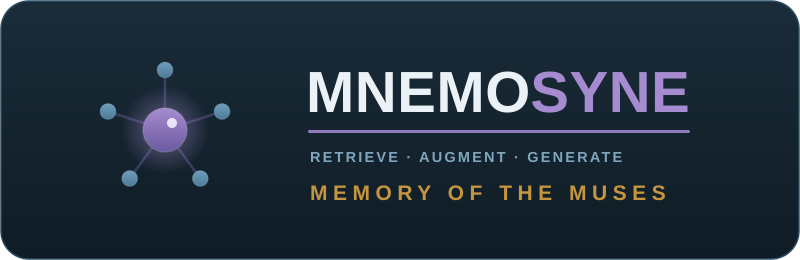

# Mnemosyne



[](https://github.com/freed-dev-llc/mnemosyne/actions/workflows/ci.yml)
[](https://codecov.io/gh/freed-dev-llc/mnemosyne)
[](https://www.python.org/downloads/)
[](LICENSE)
[](https://github.com/astral-sh/ruff)
[](#3-technology)

> **Mnemosyne** (*nee-MAH-suh-nee*): Titaness of memory, mother of the nine Muses. A
> local Retrieval-Augmented Generation (RAG) pipeline that turns any model into an instant
> expert on documents it has never seen, no fine-tuning required.

Mnemosyne is a **teaching-first RAG pipeline** built on
**[Ollama](https://ollama.com) + [LangChain](https://www.langchain.com) +
[FAISS](https://github.com/facebookresearch/faiss)**: entirely local, no API keys, no
data leaving the box. Point it at a corpus and it embeds and indexes that corpus; a small
local model then answers questions about it *with citations*, as if it had read every
page. In Greek myth, Mnemosyne was memory itself, the wellspring the Muses drew knowledge
from. That's the job here: be the memory a model retrieves from.

**Part of the freed-dev-llc family.** Mnemosyne is the **knowledge brain**: its first real use
case is being a **local expert for [Argus](https://github.com/freed-dev-llc/argus)** (a network
source-of-truth), fed by the same vendors Argus discovers, starting with **Ubiquiti**.

[](https://github.com/freed-dev-llc/argus)

---

## Start Here

| Need | Read | Tokens (~) |
|------|------|------------|
| **What RAG is, from first principles** | [`docs/RAG-101.md`](docs/RAG-101.md): the teaching core (chunk → embed → index → retrieve → generate) | ~4k |
| **How the pipeline is wired** | [`docs/ARCHITECTURE.md`](docs/ARCHITECTURE.md): modules, data flow, where to change things | ~3k |
| **Knowledge packs (the plugin model)** | [`docs/KNOWLEDGE_PACKS.md`](docs/KNOWLEDGE_PACKS.md): how a corpus becomes an expert; build your own | ~2k |
| **What's planned** | [`docs/ROADMAP.md`](docs/ROADMAP.md): Ubiquiti corpus maturity, then vendor-pack parity with Argus | ~1k |
| **Design decisions** | [`docs/architecture/adr/`](docs/architecture/adr/): why Ollama/LangChain/FAISS, why packs | ~2k |

---

## Table of Contents

1. [The idea](#1-the-idea)
2. [How it works](#2-how-it-works)
3. [Technology](#3-technology)
4. [Quickstart](#4-quickstart)
5. [Knowledge packs](#5-knowledge-packs)
6. [Use case: a local brain for Argus](#6-use-case-a-local-brain-for-argus)
7. [Repository layout](#7-repository-layout)
8. [Roadmap](#8-roadmap)
9. [Contributing](#9-contributing)
10. [License](#10-license)

---

## 1. The idea

A base model knows a lot of *general* things and very few of *your* things. Fine-tuning to
fix that is slow, expensive, and stale the moment your docs change. **Retrieval-Augmented
Generation** takes the other road: leave the model's weights alone and, at question time,
*retrieve* the few passages that actually matter and hand them to the model as context.
The model doesn't need to have *memorized* the Ubiquiti switching guide; it just needs it
in front of it for the next 4,000 tokens.

Mnemosyne exists to make that loop **legible**. Every stage is a small, readable module
you can open, change, and measure. It is a repo to *learn RAG by building it*, not a
black box, and to grow into something useful for the family.

> **Credit.** The pipeline shape and defaults follow Mariya Sha's excellent
> [rag_ollama](https://github.com/MariyaSha/rag_ollama) tutorial
> ([video](https://youtu.be/oZYlrooPgvs)): Mnemosyne reworks that notebook crash-course
> into an installable, knowledge-pack-based package (no notebook), keeps its Ollama +
> LangChain + FAISS stack and tiny-model defaults, and adds the pack framework, CLI, and
> family scaffolding. Her demo corpus (a delightful "is Lord Elrond secretly Agent Smith?"
> investigation) lives in her repo; Mnemosyne ships its own Ubiquiti example instead.

## 2. How it works

```
                          INGEST (build the memory)
  documents ─► load ─► chunk ─► embed (Ollama) ─► FAISS index ─► knowledge/<pack>/index.faiss
  (md/pdf/html/txt)            (bge-m3)                          (saved to disk, reusable)

                          ASK (retrieve + generate)
  question ─► embed ─► FAISS top-k search ─► stuff context + question into prompt
                                                   │
                                                   ▼
                              Ollama LLM (llama3.1 / qwen2.5 …) ─► answer + citations
```

Two paths, one index. **Ingest** is run once per corpus (and re-run when docs change);
it is the slow, expensive part. **Ask** is cheap and local: embed the question, pull the
nearest chunks out of FAISS, and let a small Ollama model write the answer grounded in
exactly those chunks. Nothing leaves the machine. If nothing in the index is close enough
to the question, Ask answers "not in the knowledge base" rather than reaching for unrelated
chunks: a relevance floor (`MNEMOSYNE_SCORE_FLOOR`, on by default) keeps off-topic questions
from getting confident, ungrounded answers.

See [`docs/RAG-101.md`](docs/RAG-101.md) for the *why* behind every box, and
[`docs/ARCHITECTURE.md`](docs/ARCHITECTURE.md) for which module owns each one.

## 3. Technology

| Layer | Choice | Why |
| --- | --- | --- |
| **LLM + embeddings** | [Ollama](https://ollama.com) | Local, free, swappable models; one runtime for chat (`qwen2.5:1.5b`) *and* `bge-m3` embeddings. |
| **Orchestration** | [LangChain](https://www.langchain.com) | Batteries-included loaders, splitters, retrievers, and prompt plumbing: the teaching scaffold. |
| **Vector store** | [FAISS](https://github.com/facebookresearch/faiss) | Fast, file-based, zero-service similarity search; the index is just a file you can ship. |
| **Environment** | [mamba](https://github.com/mamba-org/mamba) / conda | Reproducible env that ships FAISS (CPU *and* GPU) from conda-forge; swap one file to go GPU. |
| **Packaging** | Python 3.11+, `pyproject.toml`, `ruff` | Installable `mnemosyne` package + `mnemosyne` CLI; family lint/CI baseline. |

The chat backend is also swappable: set `chat_provider=openai` (env `MNEMOSYNE_CHAT_PROVIDER`)
and generation can target any OpenAI-compatible server, such as vLLM, llama.cpp's server, or
LM Studio ([ADR-0009](docs/architecture/adr/0009-selectable-chat-backend.md)). Embeddings stay
Ollama-only, and the default (`chat_provider=ollama`) is unchanged, so the Ollama row above
stays accurate as written.

> Defaults are tiny and CPU-friendly, following the [rag_ollama](https://github.com/MariyaSha/rag_ollama)
> tutorial this project is based on: `bge-m3` for embeddings and `qwen2.5:1.5b` for
> generation, with `chunk_size=500 / chunk_overlap=150 / k=5`. Override per-pack (in a
> pack's `manifest.yaml`) or globally via `.env`; see [`.env.example`](.env.example).

## 4. Quickstart

**Prerequisites:** [Ollama](https://ollama.com/download) running locally, and `mamba`:
the simplest way to get it is [Miniforge](https://github.com/conda-forge/miniforge), which
bundles conda + mamba with conda-forge preconfigured (plain conda works too).

```bash
# 0. Pull the default models (once)
ollama pull bge-m3          # embeddings
ollama pull qwen2.5:1.5b    # tiny chat model

# 1. Create the environment with mamba and install Mnemosyne
mamba env create -f environment.yml      # GPU? use environment-gpu.yml instead
mamba activate mnemosyne

# 2. Build the memory for a knowledge pack (embeds + indexes its corpus)
mnemosyne ingest ubiquiti

# 3. Ask the expert
mnemosyne ask ubiquiti "How do I adopt a UniFi switch to a remote controller?"

# Or explore interactively (with chat history)
mnemosyne chat ubiquiti
```

> **No conda?** A bare-pip path works too: `pip install -e ".[dev,cpu]"` (the `cpu` extra
> pulls `faiss-cpu` from PyPI). The mamba path is preferred because it also unlocks GPU
> FAISS by swapping in `environment-gpu.yml`; see [ADR-0004](docs/architecture/adr/0004-conda-mamba-environment.md).

`ingest` writes a reusable FAISS index under `knowledge/`; `ask` and `chat` load it and
answer with inline `[source]` citations. List what's available with `mnemosyne packs`.

```bash
mnemosyne packs            # list installed knowledge packs and index status
mnemosyne ingest --help    # chunking / embedding-model overrides
mnemosyne ask --help       # top-k, model, show-sources flags
mnemosyne eval --help      # retrieval hit-rate + answer faithfulness against a labelled question set
mnemosyne sweep --help     # chunk-size / k / model sweeps to pick defaults from data
```

### Use from a coding agent (MCP)

Mnemosyne ships an MCP stdio server (`mnemosyne-mcp`) so MCP clients (Claude Code, and the
agents behind Argus) can ground answers in its packs. A local
`.mcp.json` registers it; the tools are:

- `list_packs`: packs + whether each has a built index
- `ask(pack, question, k?)`: a grounded answer with cited sources
- `search(pack, query, k?)`: the top-k raw chunks, to reason over yourself

The server honors `MNEMOSYNE_OLLAMA_HOST` from its environment. Because some MCP clients spawn
servers with a stripped environment, set it explicitly when needed:

```jsonc
// .mcp.json
{ "mcpServers": { "mnemosyne": { "type": "stdio", "command": "mnemosyne-mcp",
    "env": { "MNEMOSYNE_OLLAMA_HOST": "http://localhost:11434" } } } }
```

### Use from a web UI or service (HTTP)

Web UIs (e.g. an "ask the brain" box in the Argus dashboard) can't speak MCP, so Mnemosyne
also ships a FastAPI server (`mnemosyne-http`, default `127.0.0.1:8088`):

```bash
mnemosyne-http      # GET /health · GET /packs · POST /ask · POST /search
curl -s localhost:8088/ask -H 'content-type: application/json' \
  -d '{"pack":"ubiquiti","question":"How do I adopt a switch remotely?"}'
```

`POST /ask` → `{answer, sources[]}`; `POST /search` → `{results[]}`. Intended to be called
**server-to-server** (e.g. an Argus backend proxies to it), so there's no browser CORS to
manage. Bind address is `MNEMOSYNE_HTTP_HOST` / `MNEMOSYNE_HTTP_PORT`. Interactive API docs are
at `/docs`, and the service serves its app icon at `/favicon.svg`.

To run it as a managed service (systemd) and let a remote consumer such as Argus reach it over a mesh network, see [`deploy/README.md`](deploy/README.md).

## 5. Knowledge packs

A **knowledge pack** is a self-contained expert: a corpus plus a small manifest describing
how to load, chunk, and prompt it. The design deliberately mirrors **Argus vendor packs**
([ADR-0005](https://github.com/freed-dev-llc/argus/blob/main/docs/architecture/adr/0005-vendor-packs.md)):
each pack is discovered via a `mnemosyne.knowledge_packs` entry point, so packs can live
in-tree or ship out-of-tree and independently.

```
src/mnemosyne/packs/ubiquiti/
├── manifest.yaml     # name, models, chunking, sources, system prompt
├── pack.py           # the KnowledgePack implementation (loaders + metadata)
└── sources/          # URLs / local docs that make up the corpus
```

Two packs ship in-tree: **`ubiquiti`** (the technical worked example) and **`general`**, a
curated corpus of operating principles and decision heuristics, the project-agnostic
counterpart that grounds *how to decide* rather than *how a technology works*. To build your
own, copy a pack directory, edit
the manifest, point it at your docs, and `mnemosyne ingest <yourpack>`. See
[`docs/KNOWLEDGE_PACKS.md`](docs/KNOWLEDGE_PACKS.md).

## 6. Use case: a local brain for Argus

[Argus](https://github.com/freed-dev-llc/argus) keeps a network's *truth* in NetBox by
discovering devices through **vendor packs** (UniFi in-tree today). But discovery answers
*"what is on the network."* It doesn't answer *"how does this technology actually work,
and what should I do about it?"* That second question needs an **expert**, and that expert
needs the vendor's documentation at its fingertips.

Mnemosyne is that expert. The plan is to **mirror Argus's vendor packs as Mnemosyne
knowledge packs**: Argus discovers Ubiquiti, Mnemosyne *explains* Ubiquiti, so an MCP
agent can ask "Argus, what's on the network?" and "Mnemosyne, how do I fix this UniFi
adoption loop?" and get grounded answers to both. Ubiquiti is the shared starting point;
the two repos expand vendor coverage in step. See [`docs/ROADMAP.md`](docs/ROADMAP.md).

## 7. Repository layout

| Path | What |
| --- | --- |
| `src/mnemosyne/` | The pipeline: `loaders`, `chunking`, `embeddings`, `index`, `pipeline`, `prompts`, `cli` |
| `src/mnemosyne/packs/` | Knowledge-pack framework (`base`, `registry`) + the in-tree `ubiquiti` pack |
| `docs/` | `RAG-101` (teaching), `ARCHITECTURE`, `KNOWLEDGE_PACKS`, `ROADMAP`, and ADRs |
| `knowledge/` | Built FAISS indices + raw corpora (gitignored; rebuilt by `ingest`) |
| `examples/` | Minimal scripts showing the API end-to-end |
| `tests/` | Pytest suite (chunking, index, pack discovery) |
| `.github/` | CI, Dependabot, issue/PR templates, CODEOWNERS |

## 8. Roadmap

Mnemosyne started as a *teaching* pipeline and is growing toward a *useful* one. Full
detail in [`docs/ROADMAP.md`](docs/ROADMAP.md):

- **v0.1: the loop works (shipped).** `ingest` → `ask`/`chat` end-to-end on the Ubiquiti pack with citations.
- **v0.2: measure it (shipped).** Eval harness (`mnemosyne eval`): retrieval hit-rate and answer faithfulness, with a CI regression gate.
- **v0.3: serve it (shipped).** MCP (`mnemosyne-mcp`) and HTTP (`mnemosyne-http`) transports so coding agents (e.g. Argus) can call Mnemosyne as a tool.
- **v0.x: vendor-pack parity with Argus (current).** Maturing the Ubiquiti corpus and expanding knowledge packs in lockstep with Argus discovery.

## 9. Contributing

This is a personal project run with the discipline of a shared one: changes land via
**signed-commit pull requests** with a CHANGELOG entry, decisions are captured as
**ADRs**, and work is tracked in **issues**. See [CONTRIBUTING.md](CONTRIBUTING.md).

## 10. License

[Apache-2.0](LICENSE).
